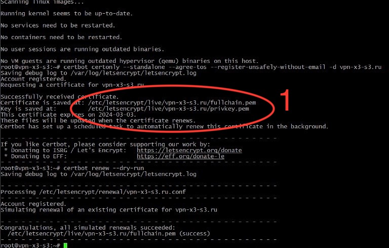
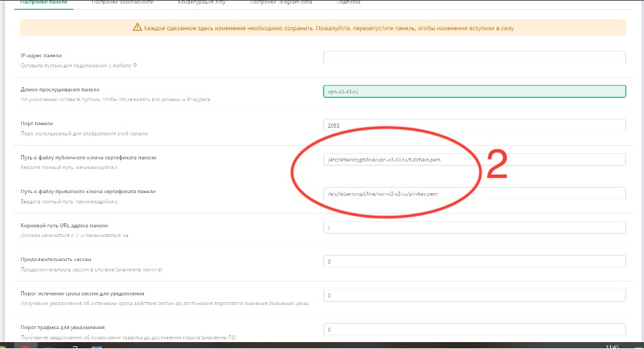
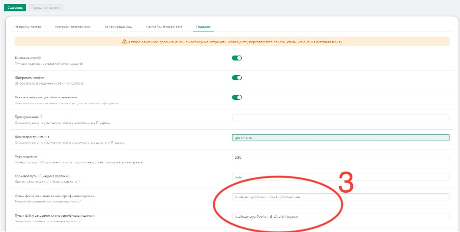

# 3X-UI


<p align="center"><a href="#"></a></p>

**Расширенная веб-панель • Построена на Xray Core**

[](https://github.com/artn95/3x-ui/releases)
[](#)
[](#)
[](#)
[](https://www.gnu.org/licenses/gpl-3.0.en.html)


## 1. Установить и обновить

```
bash <(curl -Ls https://raw.githubusercontent.com/artn95/3x-ui/master/install.sh) 
```

## 1. Установить Пользовательскую Версию

Чтобы установить нужную версию, добавьте версию в конец команды установки. например, версия `v2.2.6`:

```
bash <(curl -Ls https://raw.githubusercontent.com/artn95/3x-ui/master/install.sh) v2.2.6
```

## 2. SSL сертификат

<details>
  <summary>Нажмите для получения SSL-сертификата</summary>

### Облачная вспышка

Скрипт управления имеет встроенное приложение SSL-сертификата для Cloudflare. Чтобы использовать этот скрипт для подачи заявки на сертификат, вам нужно следующее:

- Электронная почта, зарегистрированная Cloudflare
- Глобальный ключ API Cloudflare
- Доменное имя было разрешено текущему серверу через cloudflare

**2.1:** Запустите `x-ui`на терминале, затем выберите `Cloudflare SSL Certificate`.


### Certbot
```
apt-get install certbot -y```
```
```
certbot certonly --standalone --agree-tos --register-unsafely-without-email -d (добовляем свой домен)
```
```
certbot renew --dry-run
```

***Совет:*** *Certbot также встроен в скрипт управления. Вы можете запустить команду `x-ui` а затем выбрать `SSL Certificate Management`.*

**2.2:** Заходите в панель управления http://`домен`:2053/panel/settings, после копируем пути сертификатов в панел управления из терминала 





</details>

## Ручная установка и обновление

<details>
  <summary>Нажмите для получения подробной информации об установке вручную</summary>

#### Использование

1. Чтобы загрузить последнюю версию сжатого пакета непосредственно на ваш сервер, выполните следующую команду:

```sh
ARCH=$(uname -m)
case "${ARCH}" in
  x86_64 | x64 | amd64) XUI_ARCH="amd64" ;;
  i*86 | x86) XUI_ARCH="386" ;;
  armv8* | armv8 | arm64 | aarch64) XUI_ARCH="arm64" ;;
  armv7* | armv7) XUI_ARCH="armv7" ;;
  armv6* | armv6) XUI_ARCH="armv6" ;;
  armv5* | armv5) XUI_ARCH="armv5" ;;
  *) XUI_ARCH="amd64" ;;
esac


wget https://github.com/artn95/3x-ui/releases/latest/download/x-ui-linux-${XUI_ARCH}.tar.gz
```

2. После загрузки сжатого пакета выполните следующие команды для установки или обновления x-ui:

```sh
ARCH=$(uname -m)
case "${ARCH}" in
  x86_64 | x64 | amd64) XUI_ARCH="amd64" ;;
  i*86 | x86) XUI_ARCH="386" ;;
  armv8* | armv8 | arm64 | aarch64) XUI_ARCH="arm64" ;;
  armv7* | armv7) XUI_ARCH="armv7" ;;
  armv6* | armv6) XUI_ARCH="armv6" ;;
  armv5* | armv5) XUI_ARCH="armv5" ;;
  *) XUI_ARCH="amd64" ;;
esac

cd /root/
rm -rf x-ui/ /usr/local/x-ui/ /usr/bin/x-ui
tar zxvf x-ui-linux-${XUI_ARCH}.tar.gz
chmod +x x-ui/x-ui x-ui/bin/xray-linux-* x-ui/x-ui.sh
cp x-ui/x-ui.sh /usr/bin/x-ui
cp -f x-ui/x-ui.service /etc/systemd/system/
mv x-ui/ /usr/local/
systemctl daemon-reload
systemctl enable x-ui
systemctl restart x-ui
```

</details>

## Установить с помощью Docker

<details>
  <summary>Нажмите для получения подробной информации о Docker</summary>

#### Использование

1. Установить Docker:

   ```sh
   bash <(curl -sSL https://get.docker.com)
   ```

2. Клонировать репозиторий проекта:

   ```sh
   git clone https://github.com/artn95/3x-ui.git
   cd 3x-ui
   ```

3. Запустить сервис

   ```sh
   docker compose up -d
   ```

   ИЛИ

   ```sh
   docker run -itd \
      -e XRAY_VMESS_AEAD_FORCED=false \
      -v $PWD/db/:/etc/x-ui/ \
      -v $PWD/cert/:/root/cert/ \
      --network=host \
      --restart=unless-stopped \
      --name 3x-ui \
      ghcr.io/artn95/3x-ui:latest
   ```

обновить до последней версии

   ```sh
    cd 3x-ui
    docker compose down
    docker compose pull 3x-ui
    docker compose up -d
   ```

удалить 3x-ui из докера 

   ```sh
    docker stop 3x-ui
    docker rm 3x-ui
    cd --
    rm -r 3x-ui
   ```

</details>


## Рекомендуемая ОС

- Ubuntu 20.04+
- Debian 11+
- CentOS 8+
- Fedora 36+
- Arch Linux
- Manjaro
- Armbian
- AlmaLinux 9+
- Rockylinux 9+

## Поддерживаемые архитектуры и устройства

<details>
  <summary>Нажмите для получения подробной информации о поддерживаемых архитектурах и устройствах</summary>

Наша платформа обеспечивает совместимость с различными архитектурами и устройствами, обеспечивая гибкость в различных вычислительных средах. Ниже приведены ключевые архитектуры, которые мы поддерживаем:

- **amd64**: Эта распространенная архитектура является стандартом для персональных компьютеров и серверов, беспрепятственно вмещая большинство современных операционных систем.

- **x86 / i386**: Широко распространенная в настольных и портативных компьютерах, эта архитектура пользуется широкой поддержкой многочисленных операционных систем и приложений, включая, помимо прочего, системы Windows, macOS и Linux.

- **armv8 / arm64 / aarch64**: Эта архитектура, адаптированная для современных мобильных и встроенных устройств, таких как смартфоны и планшеты, является примером таких устройств, как Raspberry Pi 4, Raspberry Pi 3, Raspberry Pi Zero 2/Zero 2 W, Orange Pi 3 LTS и многое другое.

- **armv7 / arm / arm32**: Выступая в качестве архитектуры для старых мобильных и встроенных устройств, он по-прежнему широко используется в таких устройствах, как Orange Pi Zero LTS, Orange Pi PC Plus, Raspberry Pi 2 и других.

- **armv6 / arm / arm32**: Эта архитектура, ориентированная на очень старые встроенные устройства, хотя и менее распространена, все еще используется. Такие устройства, как Raspberry Pi 1, Raspberry Pi Zero/Zero W, полагаются на эту архитектуру.

- **armv5 / arm / arm32**: Старая архитектура, в основном связанная с ранними встроенными системами, сегодня она менее распространена, но все еще может быть найдена в устаревших устройствах, таких как ранние версии Raspberry Pi и некоторые старые смартфоны.
</details>

## Языки

- английский
- Французкий
- Китайский
- Русский
- Вьетнамский
- Испанский
- Индонезийский 
- Украинский


## ХАРАКТЕРИСТИКИ

- Мониторинг Состояния Системы
- Поиск по всем входящим и клиентам
- Темная/светлая тема
- Поддерживает многопользовательский и многопротокольный
- Поддерживает протоколы, включая VMess, VLESS, Trojan, Shadowsocks, Dokodemo-door, Socks, HTTP, wireguard
- Поддерживает собственные протоколы XTLS, включая RPRX-Direct, Vision, REALITY
- Статистика трафика, лимит трафика, срок действия
- Настраиваемые шаблоны конфигурации Xray
- Поддерживает панель доступа HTTPS (самоутверждённое доменное имя + SSL-сертификат)
- Поддерживает приложение SSL-сертификата в один клик и автоматическое продление
- Для получения более продвинутых элементов конфигурации, пожалуйста, обратитесь к панели
- Исправлены маршруты API (пользовательские настройки будут созданы с помощью API)
- Поддерживает изменение конфигураций различными элементами, представленными на панели.
- Поддерживает базу данных экспорта/импорта из панели


## Настройки По Умолчанию

<details>
  <summary>Нажмите для получения подробной информации о настройках по умолчанию</summary>

  ### информация

- **Порт:** 2053
- **Имя пользователя и пароль:** Он будет сгенерирован случайным образом, если вы пропустите изменение.
- **Путь к базе данных:**
  - /etc/x-ui/x-ui.db
- **Путь Xray Config:**
  - /usr/local/x-ui/bin/config.json
- **Путь веб-панели б//o Развертывание SSL:**
  - http://ip:2053/panel
  - http://domain:2053/panel
- **Путь веб-панели с развертыванием SSL:**
  - https://domain:2053/panel
 
</details>

## [Конфигурация WARP](https://gitlab.com/fscarmen/warp)

<details>
  <summary>Нажмите для получения подробной информации о конфигурации WARP</summary>

#### Использование

Если вы хотите использовать маршрутизацию в WARP до версии 2.1.0, выполните следующие действия:

**1.** Установите WARP в **режиме прокси-сокци SOCKS**:

   ```sh
   bash <(curl -sSL https://raw.githubusercontent.com/hamid-gh98/x-ui-scripts/main/install_warp_proxy.sh)
   ```

**2.** Если вы уже установили warp, вы можете удалить его с помощью команды ниже:

   ```sh
   warp u
   ```

**3.** Включите необходимую конфигурацию на панели

   Функции конфиг.:

   - Блокировать рекламу
   - Направьте Google + Netflix + Spotify + OpenAI (ChatGPT) в WARP
   - Исправить ошибку Google 403

</details>

## Ограничение IP

<details>
  <summary>Нажмите для получения подробной информации об IP-ограниче</summary>

#### Использование

**Примечание:** IP Limit не будет работать правильно при использовании IP-туннеля

- Для версий до  `v1.6.1`:

  - Ограничение IP-адреса встроено в панель.

- Для версий `v1.7.0` и более поздних версий:

  - Чтобы IP Limit работал должным образом, вам необходимо установить fail2ban и необходимые файлы, выполнив следующие действия:

    1. Используйте команду `x-ui` в терминале.
    2. Выберите `IP Limit Management`.
    3. Выберите подходящие варианты в зависимости от ваших потребностей.
   
  - убедитесь, что у вас есть ./access.log в вашей конфигурации Xray после версии 2.1.3, у нас есть опция для этого
  
  ```sh
    "log": {
      "access": "./access.log",
      "dnsLog": false,
      "loglevel": "warning"
    },
  ```

</details>

## Телеграм-бот

<details>
  <summary>Нажмите для получения подробной информации о боте Telegram</summary>

#### Использование

Веб-панель поддерживает ежедневный трафик, вход в панель, резервное копирование базы данных, состояние системы, информацию о клиенте и другие уведомления и функции через Telegram Bot. Чтобы использовать бота, вам необходимо установить параметры, связанные с ботом, на панели, в том числе:

- Токен Telegram
- Идентификатор(ы) чата администратора
- Время уведомления (в синтаксисе cron)
- Уведомление о дате истечения срока действия
- Уведомление О Ограничении Трафика
- Резервное копирование базы данных
- Уведомление о загрузке процессора


**Справочный синтаксис:**

- `30 \* \* \* \* \*` - Уведомить в 30-х точках каждой точки
- `0 \*/10 \* \* \* \*` - Уведомлять в первую секунду каждые 10 минут
- `@hourly` - Почасовое уведомление
- `@daily` - Ежедневное уведомление (00:00 утра)
- `@weekly` - еженедельное уведомление
- `@every 8h` - Уведомлять каждые 8 часов

### Функции Telegram-бота

- Периодический отчет
- Уведомление о входе в систему
- Уведомление о пороге ЦП
- Порог для истечения срока действия и трафика для предварительной отчетности
- Меню отчета поддержки клиента, если имя пользователя телеграммы клиента добавлено в конфигурации пользователя
- Поддержка отчета о трафике телеграмм, поиск с помощью UUID (VMESS/VLESS) или пароля (TROJAN) - анонимно
- Бот на основе меню
- Поиск клиента по электронной почте (только для администратора)
- Проверьте все входящие
- Проверить статус сервера
- Проверьте истощенных пользователей
- Получить резервную копию по запросу и в периодических отчетах
- Многоязычный бот

### Настройка Telegram-бота

- Запустите [Botfather](https://t.me/BotFather) в своей учетной записи Telegram:
    
  
- Создайте нового бота с помощью команды /newbot: он задаст вам 2 вопроса, имя и имя пользователя для вашего бота. Обратите внимание, что имя пользователя должно заканчиваться словом "бот".
    

- Запустите бота, который вы только что создали. Вы можете найти ссылку на своего бота здесь.
    

- Введите свою панель и настройте настройки бота Telegram, как показано ниже:


Введите свой токен бота в поле ввода номер 3. Введите идентификатор пользователя в поле ввода номер 4. Учетные записи Telegram с этим идентификатором будут администратором бота. (Вы можете ввести более одного, просто разделите их с помощью ,)

- Как получить идентификатор пользователя Telegram? Используйте этого [бота](https://t.me/useridinfobot), запустите бота, и он даст вам идентификатор пользователя Telegram.


</details>

## Маршруты API

<details>
  <summary>Нажмите для получения подробной информации о маршрутах API</summary>

#### Использование

- `/login` с `POST` Пользовательские данные: `{username: '', password: ''}` Для входа в систему
- `/panel/api/inbounds` база для следующих действий:

| Method | Path                               | Action                                      |
| :----: | ---------------------------------- | ------------------------------------------- |
| `GET`  | `"/list"`                          | Get all inbounds                            |
| `GET`  | `"/get/:id"`                       | Get inbound with inbound.id                 |
| `GET`  | `"/getClientTraffics/:email"`      | Get Client Traffics with email              |
| `GET`  | `"/createbackup"`                  | Telegram bot sends backup to admins         |
| `POST` | `"/add"`                           | Add inbound                                 |
| `POST` | `"/del/:id"`                       | Delete Inbound                              |
| `POST` | `"/update/:id"`                    | Update Inbound                              |
| `POST` | `"/clientIps/:email"`              | Client Ip address                           |
| `POST` | `"/clearClientIps/:email"`         | Clear Client Ip address                     |
| `POST` | `"/addClient"`                     | Add Client to inbound                       |
| `POST` | `"/:id/delClient/:clientId"`       | Delete Client by clientId\*                 |
| `POST` | `"/updateClient/:clientId"`        | Update Client by clientId\*                 |
| `POST` | `"/:id/resetClientTraffic/:email"` | Reset Client's Traffic                      |
| `POST` | `"/resetAllTraffics"`              | Reset traffics of all inbounds              |
| `POST` | `"/resetAllClientTraffics/:id"`    | Reset traffics of all clients in an inbound |
| `POST` | `"/delDepletedClients/:id"`        | Delete inbound depleted clients (-1: all)   |
| `POST` | `"/onlines"`                       | Get Online users ( list of emails )       |

\*- Поле `clientId` Должен быть заполнен:

- `client.id` для VMESS и VLESS
- `client.password` для TROJAN
- `client.email` для Shadowsocks


- [Документация по API](https://documenter.getpostman.com/view/16802678/2s9YkgD5jm)
- [](https://app.getpostman.com/run-collection/16802678-1a4c9270-ac77-40ed-959a-7aa56dc4a415?action=collection%2Ffork&source=rip_markdown&collection-url=entityId%3D16802678-1a4c9270-ac77-40ed-959a-7aa56dc4a415%26entityType%3Dcollection%26workspaceId%3D2cd38c01-c851-4a15-a972-f181c23359d9)
</details>

## Переменные Среды

<details>
  <summary>Нажмите для получения подробной информации о переменных среды</summary>

#### Usage

| Variable       |                      Type                      | Default       |
| -------------- | :--------------------------------------------: | :------------ |
| XUI_LOG_LEVEL  | `"debug"` \| `"info"` \| `"warn"` \| `"error"` | `"info"`      |
| XUI_DEBUG      |                   `boolean`                    | `false`       |
| XUI_BIN_FOLDER |                    `string`                    | `"bin"`       |
| XUI_DB_FOLDER  |                    `string`                    | `"/etc/x-ui"` |
| XUI_LOG_FOLDER |                    `string`                    | `"/var/log"`  |

Пример:

```sh
XUI_BIN_FOLDER="bin" XUI_DB_FOLDER="/etc/x-ui" go build main.go
```

</details>

## Предварительный просмотр


